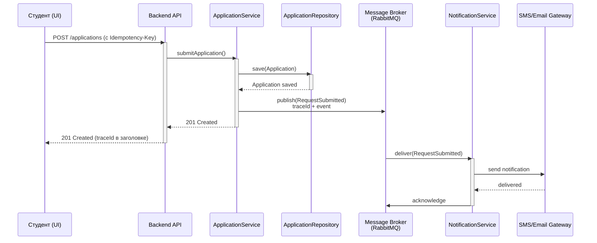

```mermaid
sequenceDiagram
    participant Student as Студент (UI)
    participant Backend as Backend API
    participant AppService as ApplicationService
    participant Repo as ApplicationRepository
    participant Broker as Message Broker<br/>(RabbitMQ)
    participant NotifService as NotificationService
    participant Gateway as SMS/Email Gateway

    Student->>Backend: POST /applications (с Idempotency-Key)
    activate Backend
    Backend->>AppService: submitApplication()
    activate AppService
    AppService->>Repo: save(Application)
    activate Repo
    Repo-->>AppService: Application saved
    deactivate Repo
    AppService->>Broker: publish(RequestSubmitted)<br/>traceId + event
    AppService-->>Backend: 201 Created
    deactivate AppService
    Backend-->>Student: 201 Created (traceId в заголовке)
    deactivate Backend

    Broker->>NotifService: deliver(RequestSubmitted)
    activate NotifService
    NotifService->>Gateway: send notification
    Gateway-->>NotifService: delivered
    NotifService->>Broker: acknowledge
    deactivate NotifService
```
