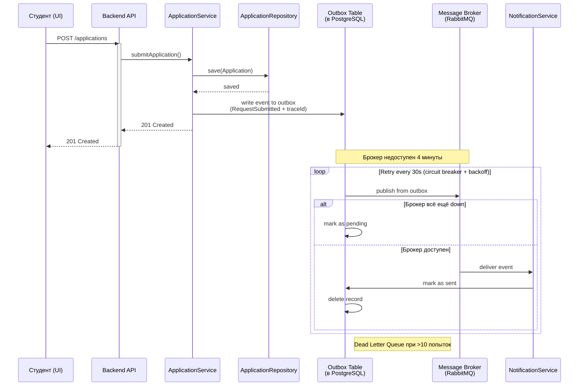

```mermaid
sequenceDiagram
    participant Student as Студент (UI)
    participant Backend as Backend API
    participant AppService as ApplicationService
    participant Repo as ApplicationRepository
    participant Outbox as Outbox Table<br/>(в PostgreSQL)
    participant Broker as Message Broker<br/>(RabbitMQ)
    participant NotifService as NotificationService

    Student->>Backend: POST /applications
    activate Backend
    Backend->>AppService: submitApplication()
    AppService->>Repo: save(Application)
    Repo-->>AppService: saved
    AppService->>Outbox: write event to outbox<br/>(RequestSubmitted + traceId)
    AppService-->>Backend: 201 Created
    Backend-->>Student: 201 Created
    deactivate Backend

    Note over Outbox,Broker: Брокер недоступен 4 минуты
    loop Retry every 30s (circuit breaker + backoff)
        Outbox->>Broker: publish from outbox
        alt Брокер всё ещё down
            Outbox->>Outbox: mark as pending
        else Брокер доступен
            Broker->>NotifService: deliver event
            NotifService->>Outbox: mark as sent
            Outbox->>Outbox: delete record
        end
    end

    Note right of Outbox: Dead Letter Queue при >10 попыток
```
